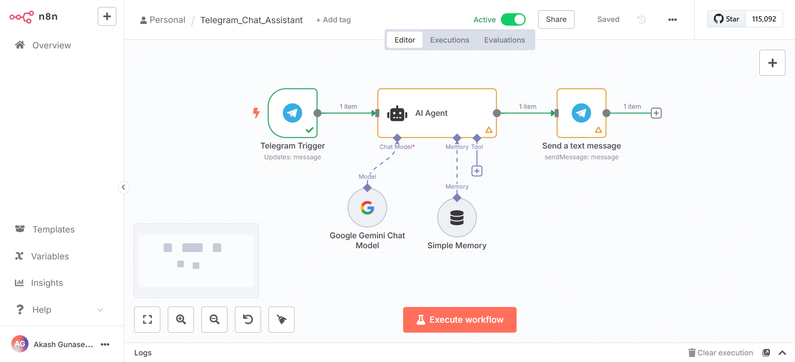
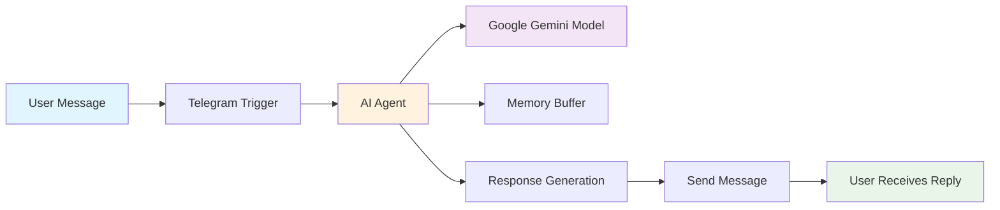

# 🤖 Telegram AI Assistant Bot

An intelligent Telegram chatbot powered by Google Gemini AI that provides contextual, conversational responses while maintaining chat memory. Built with n8n workflow automation for easy deployment and customization.

  

## 📋 Table of Contents

- [Features](#-features)
- [Architecture](#-architecture)
- [Prerequisites](#-prerequisites)
- [Quick Start](#-quick-start)

## ✨ Features

- 🧠 **AI-Powered Responses** - Uses Google Gemini 2.0 Flash for intelligent conversation
- 💭 **Conversation Memory** - Remembers context within each chat session
- 👥 **Multi-User Support** - Handles multiple users with isolated conversations
- ⚡ **Real-Time Processing** - Instant responses to user messages
- 🎯 **Optimized Responses** - Concise, helpful answers under 200 tokens
- 🔧 **Easy Customization** - Visual workflow editor for modifications
- 📱 **Mobile-Friendly** - Designed for seamless Telegram experience

## 🏗️ Architecture





### Core Components

| Component            | Purpose                           | Technology              |
| -------------------- | --------------------------------- | ----------------------- |
| **Telegram Trigger** | Receives incoming messages        | n8n Telegram Node       |
| **AI Agent**         | Processes and generates responses | LangChain Agent         |
| **Gemini Model**     | Provides AI language capabilities | Google Gemini 2.0 Flash |
| **Memory Buffer**    | Stores conversation context       | LangChain Memory        |
| **Message Sender**   | Delivers responses to users       | n8n Telegram Node       |

## 📋 Prerequisites

### Required Accounts & APIs

- [n8n](https://n8n.io/) - Workflow automation platform
- [Telegram Bot Token](https://core.telegram.org/bots#botfather) - Create via @BotFather
- [Google AI Studio](https://aistudio.google.com/) - For Gemini API access

### System Requirements

- n8n instance (cloud or self-hosted)
- Internet connectivity for API calls
- Basic understanding of JSON and workflow concepts

## 🚀 Quick Start

### 1. Clone or Download Workflow

```bash
# Clone the workflow JSON file from the repository
git clone https://github.com/Akash-Gunasekar/n8n-workflows.git
```

### 2. Set Up Telegram Bot

1. Message [@BotFather](https://t.me/botfather) on Telegram
2. Create a new bot: `/newbot`
3. Follow prompts to name your bot
4. Save the bot token for later
5. Get the token to access the HTTP API

### 3. Get Google Gemini API Key

1. Visit [Google AI Studio](https://aistudio.google.com/)
2. Create a new project or select existing
3. Generate an API key
4. Save the key securely

### 4. Import to n8n

1. Open your n8n instance
2. Click **Import from File** or **Import from URL**
3. Upload the `Telegram_AI_Assistant.json` file
4. Workflow will be imported with new node IDs

### 5. Configure Credentials

#### Telegram API Credential

```
Name: Telegram account
Token: [Your Bot Token from BotFather]
```

#### Google Gemini API Credential

```
Name: Google Gemini(PaLM) Api account
API Key: [Your Gemini API Key]
```

### 6. Activate Workflow

1. Save all configurations
2. Click **Active** toggle to enable
3. Test by sending a message to your bot

## 🙏 Acknowledgments

- [n8n](https://n8n.io/) - Workflow automation platform
- [Google Gemini](https://ai.google.dev/) - AI language model
- [LangChain](https://langchain.com/) - AI framework
- [Telegram](https://telegram.org/) - Messaging platform

**Made with ❤️ by Akash Gunasekar**

_Star ⭐ this repo if it helped you build something awesome!_
